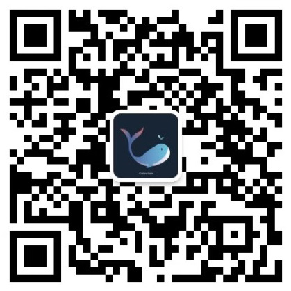

  <a href="./README_EN.md">English</a> | 中文

    
    <h1>从零开始的异世界 YOLO （Re: Zero-Starting YOLO in Another World）</h1>
    
 一场从目标检测入门，到掌握智能视觉力量的冒险旅程 

    
    
    
    

## 🌌 欢迎来到 YOLO 异世界

&emsp;&emsp;如果说深度学习让机器获得了“学习”的能力，那么计算机视觉则赋予了机器观察世界的力量。而目标检测，正是连接现实世界与智能系统的重要桥梁。从自动驾驶、无人机巡检，到工业质检、智能安防，目标检测技术正在不断改变我们理解和感知世界的方式。

&emsp;&emsp;在过去几年中，YOLO（You Only Look Once）系列算法凭借其高效、实时的特点，成为目标检测领域最具影响力的技术路线之一。从 YOLOv1 开启单阶段检测时代，到 YOLOv8、YOLO11、YOLO26 持续探索更高效、更强大的视觉模型，YOLO 已经成为无数视觉冒险者进入计算机视觉世界的第一把钥匙。

&emsp;&emsp;然而，对于许多刚踏入计算机视觉领域的学习者而言，YOLO 仍然像一片未知的迷雾森林。

&emsp;&emsp;现有教程往往存在一些问题：

- 有些教程侧重模型调用，只告诉你“如何运行 YOLO”，却没有解释“为什么 YOLO 要这样设计”；
- 有些资料停留在论文解析，缺少从理论到代码、从算法到工程的完整路径；
- 有些教程覆盖大量模型版本，却缺少一条适合初学者逐步成长的学习路线。

&emsp;&emsp;因此，我们创建了 <strong>《从零开始的异世界 YOLO（Re: Zero-Starting YOLO in Another World）》</strong>。

&emsp;&emsp;这是一份面向初学者、开发者与研究者的 <strong>系统性 YOLO 学习指南</strong>。我们希望带领每一位冒险者穿越目标检测的未知领域，从理解计算机视觉基础开始，逐步掌握 YOLO 的核心原理、模型结构、训练方法、源码实现与工业部署。

&emsp;&emsp;在这里，你不只是学习如何调用一个检测模型，而是将从一名 YOLO 的“使用者”，成长为能够理解、改造，甚至创造视觉模型的“构建者”。

&emsp;&emsp;愿这本冒险指南，成为你探索智能视觉世界的起点。

## 🚪 冒险入口
&emsp;&emsp;欢迎来到 YOLO 异世界！

&emsp;&emsp;无论你是一名刚刚接触计算机视觉的初学者，还是希望深入探索 YOLO 模型设计的开发者，这里都准备了一条从入门到进阶的成长路线。

&emsp;&emsp;在这场冒险中，你将从最基础的视觉知识出发，逐步穿越目标检测的迷雾森林，理解 YOLO 背后的核心思想，并最终掌握训练、优化与部署属于自己的视觉模型的方法。

## 🎒 冒险者的收获
&emsp;&emsp;在 YOLO 异世界中，每一位冒险者都会经历从“观察世界”到“创造世界”的成长过程。

&emsp;&emsp;这场旅程并不是简单地学习一个模型，而是逐步获得理解视觉、驾驭模型、构建智能系统的能力。

&emsp;&emsp;你将在冒险过程中，逐渐解锁以下能力：

- 📖 <strong>Datawhale 开源学习</strong>&emsp;&emsp;完全免费学习本项目内容，与社区共同探索 YOLO 世界
- 🔍 <strong>理解视觉原理</strong>&emsp;&emsp;从计算机视觉基础出发，深入理解目标检测的核心概念与发展历程
- 🎯 <strong>掌握检测基础</strong>&emsp;&emsp;理解 Bounding Box、IoU、NMS、mAP 等目标检测关键技术
- ⚔️ <strong>拆解 YOLO 模型</strong> &emsp;&emsp;深入理解 Backbone、Neck、Head、Loss 等核心组件，掌握 YOLO 架构设计思想
- 🏗️ <strong>亲手训练模型</strong> &emsp;&emsp;完成数据准备、模型训练、实验分析，构建属于自己的 YOLO 检测模型
- 🛠️ <strong>改造 YOLO 能力</strong>&emsp;&emsp;学习源码阅读、网络结构优化与模型改进方法，从模型使用者成长为开发者
- 🚀 <strong>掌握工程部署</strong> &emsp;&emsp;学习 ONNX、TensorRT、边缘设备部署等技术，让 YOLO 真正进入实际应用
- 🌌 <strong>探索未来视觉</strong>&emsp;&emsp;了解 Transformer、VLM、Mamba、Vision Agent 等下一代智能视觉方向
- 🤝 <strong>参与社区共建</strong>&emsp;&emsp;分享学习经验、实践案例与技术探索，与更多冒险者共同完善 YOLO 世界

## 🗺️ 冒险地图
&emsp;&emsp;每一位踏入 YOLO 异世界的冒险者，都将沿着这张地图，从视觉世界的入口出发，逐步探索目标检测的核心奥秘，最终掌握构建智能视觉系统的能力。

| 冒险篇章 | 核心探索内容 | 状态 |
| :-- | :-- | :-- |
| [序章：异世界入口](./docs/序章_异世界入口.md) | 项目介绍、学习路线、环境准备 | 🚧 |
| <strong>第一篇：视觉世界基础</strong> | 计算机视觉基础、深度学习基础、图像表示与特征学习 |  |
|||🚧|
| <strong>第二篇：检测之眼</strong> | 目标检测任务、Bounding Box、IoU、NMS、mAP 等核心概念 |  |
|||🚧|
| <strong>第三篇：YOLO觉醒</strong> | YOLO 核心思想、网络结构、Backbone、Neck、Head、Loss |  |
|||🚧|
| <strong>第四篇：YOLO进化编年史</strong> | YOLOv1-YOLO26 技术演进、关键改进与设计思想 |  |
|||🚧|
| <strong>第五篇：成为YOLO开发者</strong> | 数据处理、模型训练、源码解析、模型优化与改进 |  |
|||🚧|
| <strong>第六篇：工业降临</strong> | ONNX、TensorRT、模型压缩、边缘部署与实时视觉系统 |  |
|||🚧|
| <strong>第七篇：未知视觉领域</strong> | Transformer、VLM、Mamba、Open Vocabulary Detection、Vision Agent |  |
|||🚧|

## ⚔️ 冒险任务

## 🤝 冒险者集结

&emsp;&emsp;YOLO 异世界并不是一座已经完成的城堡，而是一片持续成长的探索领域。每一位冒险者在探索过程中留下的问题、经验与思考，都可能成为后来者的重要指引。

&emsp;&emsp;我们是一个开放的开源社区，欢迎你通过以下任何方式参与共建：

- 🐛 <strong>报告 Bug</strong> - 发现内容或代码问题，请提交 Issue
- 💡 <strong>提出建议</strong> - 对项目有好想法，欢迎发起讨论
- 📝 <strong>完善内容</strong> - 帮助改进教程，提交你的 Pull Request
- ✍️ <strong>分享实践</strong> - 在"社区贡献精选"中分享你的学习笔记和项目

## 🤍 同行者致谢

### 💪 贡献者

- [白雪城-项目负责人](https://github.com/Bai-Xuecheng)(Datawhale 成员，全文写作和校对)

### 👏 特别感谢
- 感谢 [@Sm1les](https://github.com/Sm1les) 对本项目的帮助与支持
- 感谢所有为本项目做出贡献的开发者们 ❤️

  

## ⭐ 点亮星辰

&emsp;&emsp;如果这份冒险指南帮助你理解 YOLO，欢迎点亮 ⭐ Star。

&emsp;&emsp;你的每一次支持，都会帮助更多冒险者找到进入计算机视觉世界的入口。

## 🐋 关于 Datawhale

    
    
扫描二维码关注 Datawhale 公众号，获取更多优质开源内容

## 📜 开源协议

本作品采用[知识共享署名-非商业性使用-相同方式共享 4.0 国际许可协议](http://creativecommons.org/licenses/by-nc-sa/4.0/)进行许可。